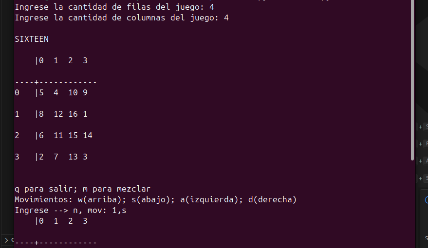

<div align="center">
  

  <h1>🧩 Sixteen</h1>

  <p>
    <strong>Fundamentos de Programación</strong><br>
    Un desafío de lógica matemática y ordenamiento matricial en terminal.
  </p>

  
  
  

  <br><br>
  
</div>

---

## 📋 Descripción

**Sixteen** es un juego de ingenio desarrollado en Python que opera sobre una matriz de números enteros (tablero). El objetivo es ordenar los números de menor a mayor (comenzando desde el 1) manipulando el tablero exclusivamente mediante **rotaciones de filas y columnas**.

El proyecto demuestra el manejo sólido de:
* Listas de listas (Matrices).
* Validación robusta de entradas de usuario.
* Modularización de código (lógica vs. interfaz).

---

## ⚙️ Requerimientos

El proyecto no utiliza librerías externas, por lo que solo necesitas:
* **Python 3.x** instalado.

---

## 🚀 Instalación y Ejecución

Sigue estos pasos para correr el juego en tu terminal:

### Ejecutar el juego

```bash
python3 main.py
```

## 🎮 Cómo Jugar

Al iniciar, el programa te pedirá definir las dimensiones del tablero (filas y columnas). Luego, el tablero se mezclará automáticamente.

### Comandos de Movimiento

El formato de entrada es: **índice,movimiento**

| Tecla | Acción |
| :---: | :--- |
| <kbd>W</kbd> (Arriba) | Rota la columna hacia arriba |
| <kbd>S</kbd> (Abajo) | Rota la columna hacia abajo |
| <kbd>A</kbd> (Izquierda) | Rota la fila hacia la izquierda |
| <kbd>D</kbd> (Derecha) | Rota la fila hacia la derecha |

### Ejemplos:

- 0,s -> Mueve la columna 0 hacia abajo.
- 2,a -> Mueve la fila 2 hacia la izquierda.

### Otros Comandos:

- m: Mezclar el tablero nuevamente.
- q: Salir del juego.

---

## 📂 Estructura del Proyecto

- sixteen.py: Motor del juego. Contiene la lógica pura (crear tablero, rotaciones, verificar si está ordenado). No interactúa con el usuario.

- main.py: Interfaz y Flujo. Se encarga de los input/print, validaciones de entrada y el bucle principal del juego.

---

## 👥 Autor

| Integrante | Padrón | Contacto |
| :--- | :---: | :---: |
| **Calderón Vasil, Máximo Augusto** | 111810 | [](https://github.com/maxivasil) [](mailto:mcalderonv@fi.uba.ar) |